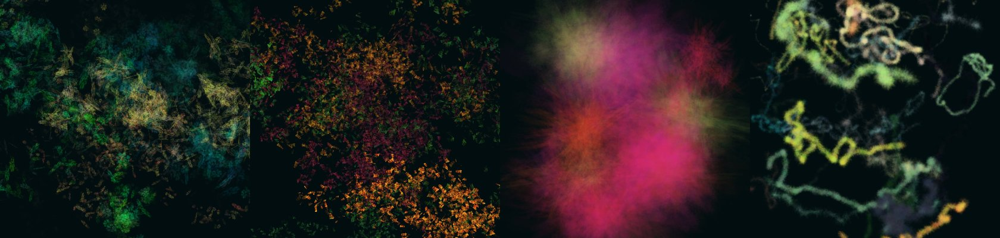

https://github.com/zomboh/amodo/assets/17140223/1acc92f6-ead3-4be6-94c7-6946b7ac68ab

# amodo - a random walker powered texture generator

*(In a hurry? You can try **amodo** at [https://amodo.pages.dev](https://amodo.pages.dev))*

**amodo sits halfway between a tool for texture artists and a generative art toy:** you can load the reference image of a stone wall as a reference for the background and then use a custom multi-texture brush walker to create moss-like vegetation on top of it... or you can play around and experiment with the parameters until you find something you simply like.

## How to use
**amodo only works in desktop computers with a somewhat capable CPU/GPU and mouse/keyboard as input devices.**

You can clone this repo and simply open `index.html` or visit [https://amodo.pages.dev](https://amodo.pages.dev), which is always up to date.

#### Quick help
- **Left click** anywhere on the canvas to create a walker.
- Explore and play with the parameters on the **right sidebar**.
- Click and drag with the **middle mouse button** to pan the canvas.
- Use your **mousewheel** to zoom in/out the canvas *(only for preview purposes, the real size is set in the parameters)*.

## Features
- **Texture size:** 64, 128, 256, 512, 1024, 2048, 4096 or 8192px (square textures).
- **Load background image** as reference.
- **Three walker modes** (at the time of writing):
    - Random walk.
    - Perlin noise.
    - Gravity.
- **Three-color palette** from which the tool will pick randomly for each branch.
- **Two types of brush**:
    - **Shape**: choose between ellipse, square and triangle, solid or stroked.
    - **Custom**: load your own texture(s). If you load more than one, the brush will become multi-texture and the tool will use a random one per point.
- **Configurable brush parameters:**
    - Size.
    - Spacing.
    - Alpha.
    - Random rotation every step.
- **Brush jitter** - easily introduce variation per point, stroke or both in:
    - Hue.
    - Saturation.
    - Lightness.
    - Alpha.
    - Size *(including non-uniform size jitter)*.
- **Several blending modes** for changing how the walkers blend with the canvas (multiply, add, screen, remove).
- A very barebones **settings manager** that allows you to reset to default, reload saved settings, and save current settings *(using the Local Storage web API)*. Settings will automatically reset if a new version is released.
- **Save to file**. This will export the texture to a transparent PNG file. You can choose to include the background (either a loaded reference image or the set background color).

## Roadmap? Future plans? PRs welcome?
Not really... this was made for fun and I already took it way beyond what the initial plans were (you know how it goes).

If I were to continue working on it, here's some stuff I'd add or improve:
- Improve performance.
- More random walker algorithms.
- Add/remove colors at will.
- Color presets.
- Settings presets.
- Sprite brushes library.
- Layers?
- Revamp UI/UX.
- Better settings management.

## Made something cool with amodo?
Please share, I'd love to see it! You can find me on [Mastodon](https://mastodon.gamedev.place/@jorge).

## Credits and license
:wave: Hi! I (Jorge) made this. I'm a multidisciplinary graphic designer currently on a sabbatical, learning and trying new stuff out. You can check more of my work at [https://www.jorgefuentes.net](https://www.jorgefuentes.net).

**amodo** would not exist without the following wonderful software and the hard work from their respective authors - thanks!
- **Tools**
    - [p5](https://p5js.org/)
    - [lil-gui](https://lil-gui.georgealways.com/)
- **Icons**
    - [tabler.io](https://tabler.io/)
    - [iconoir.com](https://iconoir.com/)
- **Typeface**
    - [IBM Plex Sans](https://www.ibm.com/plex/)

**amodo** is licensed under a GPL-3.0 license. Feel free to fork and modify it, but please share and open source your modifications!
